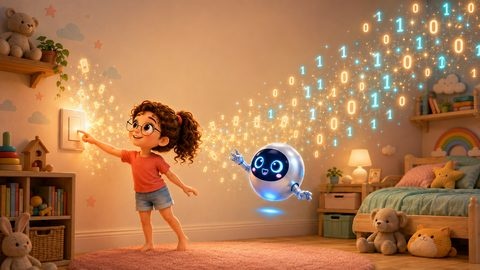
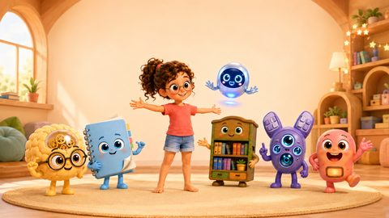
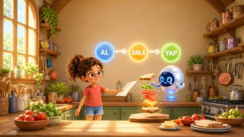
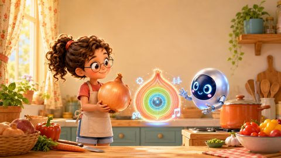
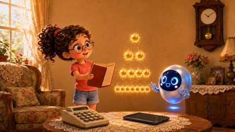

# Bilge ve Yonga — Bilgisayar Mimarisi Çocuk Kitapları

Bilgisayar biliminin temellerini okuma bilen 7-10 yaş çocuklarına hikayelerle anlatan resimli kitap serisi.
Karakterler: **Bilge** (8 yaşında, meraklı bir kız çocuğu) ve **Yonga** (yongadan doğmuş, süzülen sevimli bir robot).

Seri, Bilge ile Yonga'nın maceraları üzerinden bilgisayarların nasıl çalıştığını anlatır. Yeni kitaplar hazır oldukça bu depoya eklenecektir.

## Kitaplar

| Kapak | Kitap | Konu |
|-------|-------|------|
| <a href="kitap1.01a-kumdan-bilgisayar/"></a> | [1.1a Kumdan Bilgisayar](kitap1.01a-kumdan-bilgisayar/) | Kumdan yongaya üretim yolculuğu (TR + EN) |
| <a href="kitap1.02-milyarlarca-kucuk-anahtar/"></a> | [1.2 Milyarlarca Küçük Anahtar](kitap1.02-milyarlarca-kucuk-anahtar/) | Transistörler ve ikili sayılar |
| <a href="kitap1.03-bilgisayarin-bes-arkadasi/"></a> | [1.3 Bilgisayarın Beş Arkadaşı](kitap1.03-bilgisayarin-bes-arkadasi/) | İşlemci, bellek, depo, giriş, çıkış |
| <a href="kitap1.04-al-anla-yap/"></a> | [1.4 Al, Anla, Yap!](kitap1.04-al-anla-yap/) | Buyruk yürütüm döngüsü |
| <a href="kitap1.05-soganin-katmanlari/"></a> | [1.5 Soğanın Katmanları](kitap1.05-soganin-katmanlari/) | Donanımdan uygulamalara yazılım katmanları |
| <a href="kitap1.06-moorenun-sihirli-takvimi/"></a> | [1.6 Moore'un Sihirli Takvimi](kitap1.06-moorenun-sihirli-takvimi/) | Moore Yasası ve transistör artışı |
| <a href="kitap1.07-iki-kardes-risc-ve-cisc/"></a> | [1.7 İki Kardeş: RISC ve CISC](kitap1.07-iki-kardes-risc-ve-cisc/) | İki buyruk kümesi ailesi: az ama hızlı, çok ama güçlü |
| <a href="kitap1.08-acik-kapi/"></a> | [1.8 Açık Kapı](kitap1.08-acik-kapi/) | Açık kaynak donanım ve RISC-V: paylaşınca herkes büyür |
| <a href="kitap1.09-bilgisayarin-atesi/"></a> | [1.9 Bilgisayarın Ateşi](kitap1.09-bilgisayarin-atesi/) | Güç, ısı ve güç duvarı: bilgisayar neden ısınır |
| <a href="kitap1.10-bilgisayar-dusunmeyi-ogreniyor/"></a> | [1.10 Bilgisayar Düşünmeyi Öğreniyor](kitap1.10-bilgisayar-dusunmeyi-ogreniyor/) | Yapay zeka hızlandırıcıları: CPU, GPU, TPU, NPU |

Her kitabın klasöründe hazır **PDF** ve **EPUB** (e-kitap), tüm görseller ve metin dosyası bulunur. EPUB; iPad/Apple Books, Android, Kobo ile açılır ve "Send to Kindle" ile Kindle'a gönderilebilir.

Ayrıca depoda: `karakter_referans.png` ve `karakter_referans_besli.png` (karakter föyleri), `pdf_olustur.py` (kitap PDF'lerini üreten betik).

## Üretim yöntemi

Bu seri yapay zeka desteğiyle üretilmiştir:

- **Metinler:** Oğuz Ergin'in kurgusu ve denetiminde, Claude (Anthropic) ile birlikte yazıldı.
- **Görseller:** Karakter referans föyüne sadık kalınarak GPT görsel modeliyle üretildi (yumuşak 3D çizim stili). Her kitabın klasöründeki `promptlar_3d.md` dosyası, görsellerin üretiminde kullanılan komutları şeffaflık amacıyla içerir.
- **PDF:** `pdf_olustur.py` her sayfayı tam sayfa görsel + alt metin bandı olarak dizer.

## Atıf

Seriye ya da tek bir kitaba atıf için:

> Ergin, O. (2026). *Bilge ve Yonga: Bilgisayar Mimarisi Çocuk Kitapları Serisi*. Erişim: https://oguzergin.net/

Tek kitap örneği:

> Ergin, O. (2026). *Kumdan Bilgisayar* (Bilge ve Yonga Serisi, Kitap 1.1). Erişim: https://oguzergin.net/

BibTeX:

```bibtex
@misc{ergin2026bilgeyonga,
  author       = {Ergin, O{\u g}uz},
  title        = {Bilge ve Yonga: Bilgisayar Mimarisi {\c C}ocuk Kitaplar{\i} Serisi},
  year         = {2026},
  howpublished = {\url{https://oguzergin.net/}},
  note         = {A{\c c}{\i}k eri{\c s}imli {\c c}ocuk kitab{\i} serisi}
}
```

## Lisans

Bu eser [CC BY-NC-ND 4.0](https://creativecommons.org/licenses/by-nc-nd/4.0/deed.tr) lisansıyla sunulmaktadır: ad belirterek ve ticari olmayan amaçlarla, değiştirmeden paylaşabilirsiniz. Ayrıntı için [LICENSE](LICENSE.md) dosyasına bakınız.
